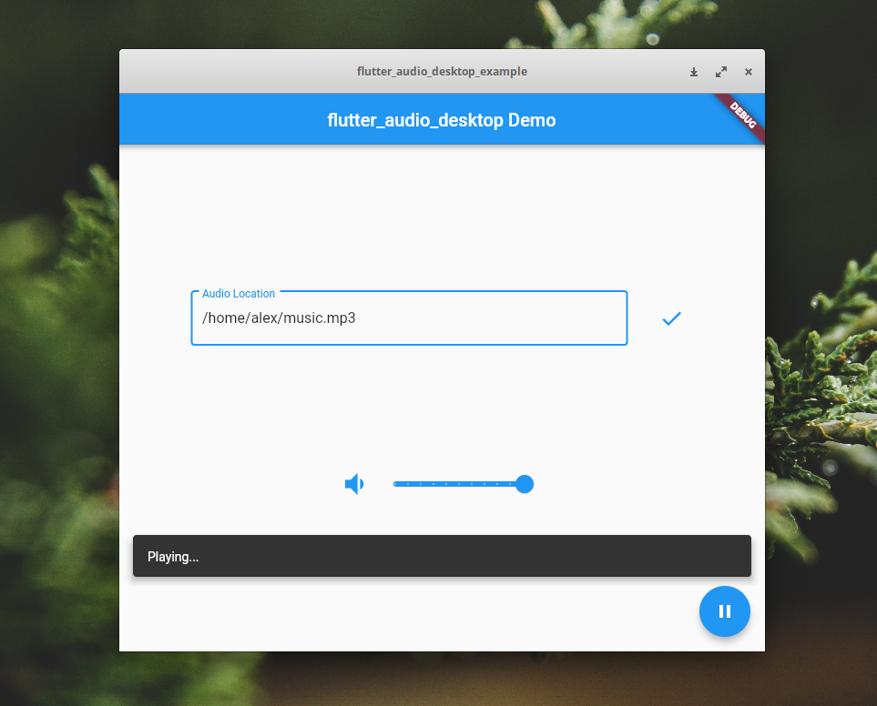

# flutter_audio_desktop

### A simple yet functional 🎵️ audio library for Flutter Desktop.
#### There is not any audio playback library for Flutter Desktop, so I made one myself.

Right now, as it is just a start, it supports MP3 playback. I'll try to increase the domain of support formats with time & plan is to provide metadata of a track aswell.


## :ok_hand: Try Now (For Linux)


```bash
git clone http://github.com/alexmercerind/flutter_audio_desktop.git --depth=1

cd flutter_audio_desktop

flutter pub get

cd example

flutter run
```

Feel free to open issue anytime.





## :triangular_ruler: Usage

**For usage in your Flutter Desktop app, checkout [this](.example/lib/main.dart) simple implementation.**

##### Easy To Use

```dart
// Start AudioPlayer. Set debug: true for extra logs.
var audioPlayer = new AudioPlayer(debug: false);

// Load audio file.
audioPlayer.load('./music.mp3');

// Start playing loaded audio file.
audioPlayer.play();
print('Duration Of Track: ${audioPlayer.getDuration()}');

// Change playback volume.
audioPlayer.setVolume(0.5);
print('Changed volume to 50%.');

// Change playback position.
audioPlayer.setPosition(Duration(seconds: 10));
print('Position of playback after skipping 60 seconds: ${audioPlayer.getPosition()}');

Timer(Duration(seconds: 10), () {

// Pause the playback.
audioPlayer.pause();
print('Playback of audio stopped after 10 seconds.');
}
```


## :heart: Like the library?

Feel free to use in your Flutter Desktop app. Consider :star: starring the repository if you want to support the development & appreciate the effort.


## :heavy_check_mark: Progress

The library is only supported on x64 systems right now.

|Platform|Status    |Remark     |
|--------|----------|-----------|
|Linux   |Working   |           |
|Windows |Not Tested|Coming Soon|
|MacOS   |Not Tested|           |

## :wrench: How It Works ?

One word, C++. I had experience with C++ & it simply uses [dart::ffi](https://dart.dev/guides/libraries/c-interop) for accessing Native C++ for playing audio. It uses the [BASS Audio Library](http://www.un4seen.com) under the hood. 

There is not any audio playback library for Flutter Desktop at the moment, so I decided to make one myself.
